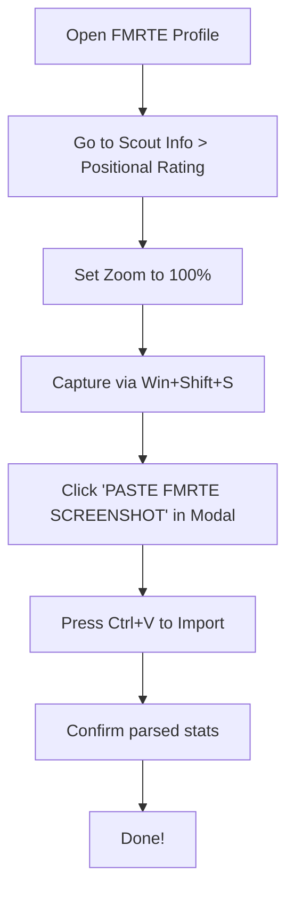

# ⚽ FM Planner — Football Manager Squad & Tactic Builder

<div align="center">
  
  
  <h3>Premium Desktop Assistant for Football Manager Tactical Planning & Squad Management</h3>

  <p>
    <a href="https://electronjs.org/"></a>
    <a href="https://nodejs.org/"></a>
    <a href="https://sqlite.org/"></a>
    <a href="https://github.com/naptha/tesseract.js"></a>
    <br/>
    <a href="https://www.fmrte.com/"></a>
    <a href="https://www.fmscout.com/"></a>
    <a href="LICENSE"></a>
  </p>
</div>

---

## 📖 About the Application

**FM Planner** is a premium, custom-designed desktop utility built specifically for tracking positional scoring weights and tactical planning in **Football Manager (FM)**. 

Designed as a companion app, it integrates seamlessly with external tools such as **FMRTE (Football Manager Real Time Editor)** and **FM Genie Scout**. These tools generate player positional suitability values (*Scoring*), which FM Planner consolidates into an intuitive, visually stunning dashboard to serve as your ultimate tactical planning hub.

---

## 🖼️ Application Screenshots

<div align="center">
  <table style="width: 100%; max-width: 1000px; border-collapse: collapse; border: none;">
    <tr style="border: none;">
      <td style="width: 50%; padding: 8px; border: none;">
        
        <p align="center"><b>Tactical Pitch & Squad Depth</b></p>
      </td>
      <td style="width: 50%; padding: 8px; border: none;">
        
        <p align="center"><b>Academy & Youth Development</b></p>
      </td>
    </tr>
    <tr style="border: none;">
      <td style="width: 50%; padding: 8px; border: none;">
        
        <p align="center"><b>Transfer Shortlist & Target Board</b></p>
      </td>
      <td style="width: 50%; padding: 8px; border: none;">
        
        <p align="center"><b>Financial & Sales Planner</b></p>
      </td>
    </tr>
    <tr style="border: none;">
      <td style="width: 50%; padding: 8px; border: none;">
        
        <p align="center"><b>Trophy Shelf</b></p>
      </td>
      <td style="width: 50%; padding: 8px; border: none;">
        
        <p align="center"><b>Elegant Light Mode Option</b></p>
      </td>
    </tr>
  </table>
</div>

---

## ⚡ Key Features & Pages

Each view is styled using a modern **Vibrant Slate Premium** design system, packed with interactive mechanics, micro-animations, and instant responses:

### 1. 📋 Tactical Pitch & Squad Depth
* **3D-Style Interactive Pitch**: Drag-and-drop players into tactical slots directly on a beautifully styled pitch with neon glow borders.
* **Undo & Redo System**: Easily undo or redo tactical experiments using standard controls.
* **Average Rating & Performance Monitor**: Calculates starting squad ratings automatically, complete with subtle danger warnings if quality dips.
* **Responsive Light/Dark Mode**: Switch between dark slate aesthetics and high-contrast light mode with a single toggle.

### 2. 🎓 Academy & Youth Development
* **Wonderkid Monitor**: Keep track of current capabilities vs. ceiling potential.
* **Dynamic Squad Segregation**: Automatic splits for Under-21 and Under-18 cohorts.
* **Smart Country Search**: Typo-tolerant nationality selector featuring dynamic flag rendering.

### 3. 🎯 Shortlist & Targets
* **Transfer Board**: Monitor target players, showing visual progress bars of their ratings.
* **Quick-Sign Action**: Promote or sign players from the shortlist directly into your main team database.

### 4. 💰 Sales & Budget Planner
* **Revenue Projector**: Estimate and tally incoming funds from proposed sales/loans to maintain healthy transfer kitties.

### 5. 🏆 Trophy Cabinet
* **Club History**: Commemorate your tournament victories, cup finals, and runner-up statuses.

---

## 🧠 Under-the-Hood Optimizations

* **Duplicate Protection**: Name parsing logic handles diacritics (e.g., standardizing *Ertuğrul* to *Ertugrul*), avoiding duplicates and throwing beautiful toast notifications.
* **Accessible Shortcuts**: Modal standard saving on `Enter`, dropdown navigation with arrow keys, and keyboard-friendly selections.
* **Optimized Light Mode**: Specialized high-contrast slate tables, borders, and input sheets for perfect legibility in any environment.

---

## 📷 AI OCR Screenshot Import (FMRTE)

Quickly populate player stats from FMRTE without manual typing.



> [!TIP]
> Keep the FMRTE page zoom at 100% and crop only the positional rating table for the cleanest text recognition.

---

## ⚙️ How to Run & Package

### Quick Start (Running the App)
To launch the application, simply double click **`FM Planner.exe`** in the root directory. 
The application loads and runs directly from **`resources/app.asar`**.

### For Developers

#### Repository Structure
- **`app_source/`**: Contains the complete editable source code of the application.
- **`resources/app.asar`**: The packaged application archive used at runtime.

#### Prerequisites
* **Node.js** (v16+)

#### Modifying & Packaging
1. Make your code modifications inside the `app_source/` directory.
2. In the root directory, install dependencies:
   ```bash
   npm install
   ```
3. Build the packaged `app.asar` archive:
   ```bash
   npm run build-asar
   ```
4. Run the updated application:
   ```bash
   npm start
   ```

---

*Built with passion for managers who love the numbers behind the beautiful game.* ⚽
